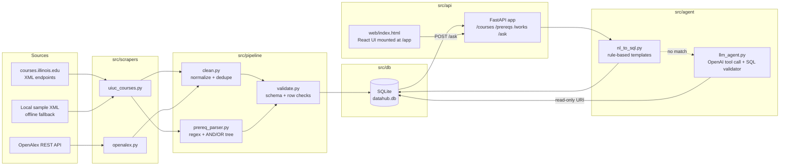

# Architecture

This project is a small, self-contained data platform. The goal is to make
the flow from **raw source → cleaned dataset → served API → agent** clear
and easy to follow.

## System diagram



## Dataflow, step by step

1. **Ingest.** Each scraper is a plain Python module with a `fetch()` function
   that yields dict records. Scrapers do only I/O + parsing; they don't touch
   the database.
2. **Clean.** `pipeline.clean` normalizes strings (whitespace, case), parses
   numeric fields, and drops obvious duplicates.
3. **Parse prereqs.** `pipeline.prereq_parser` takes a description string like
   `"Prerequisite: CS 173 and one of CS 125 or CS 128."` and returns an
   AND/OR tree plus a flat edge list `(source_course, target_course, group_id)`
   that we store.
4. **Validate.** `pipeline.validate` runs a small set of assertions
   (required fields present, credit hours within a range, subject code
   is alphabetic, prerequisite courses exist in the same subject family).
   Rejected rows go to a `rejects` table so we can inspect them later —
   we never silently drop data.
5. **Load.** `db.database.upsert_courses()` / `upsert_works()` writes to
   SQLite. The schema is in [src/db/schema.sql](src/db/schema.sql).
6. **Serve.** FastAPI reads directly from SQLite. Endpoints return JSON
   and are documented at `/docs` (Swagger).
7. **Agent.** `agent.nl_to_sql` maps a small set of question templates to
   parameterized SQL. When no template matches, it falls over to
   `agent.llm_agent`, which asks an OpenAI-compatible model to emit SQL
   via a single `query_datahub` tool call. The generated SQL is validated
   (SELECT-only, allowlisted tables, no destructive keywords) and executed
   against SQLite in read-only URI mode. The response includes a
   `source` field (`"rules"` or `"llm"`) so the caller knows which path
   answered.
8. **UI.** `web/index.html` is a zero-build React 18 page (React +
   Babel-standalone from a CDN). FastAPI mounts it at `/app/` so the
   browser POSTs to `/ask` on the same origin — no CORS setup, no build
   step, one file to review.

## Why this shape

- **One module per source.** Real DataHub-style work adds new sources
  constantly; keeping ingest code isolated makes it easy to onboard a new
  dataset without touching cleaning or serving code.
- **Cleaning is a pure function of rows.** No DB, no HTTP. Trivial to unit test.
- **Rejects are stored, not thrown.** Data engineering pain almost always
  comes from silently dropped rows. A separate `rejects` table + logging
  makes this visible.
- **SQLite for the demo.** Zero setup. The `database.py` wrapper is thin
  enough that swapping to Postgres later is ~20 lines.
- **FastAPI over Flask.** Free OpenAPI docs, type hints, aligns with the
  posting ("we primarily use FastAPI").
- **Rule-based agent first, LLM as fallover.** An LLM that translates
  "Which 400-level CS classes have CS 225 as a prereq?" into SQL is
  genuinely useful, but it needs a solid non-LLM baseline for evaluation
  and to keep the common questions fast + deterministic. The rule-based
  planner is that baseline; the LLM only runs when the rules don't match
  *and* a key is configured. Everything the LLM emits goes through the
  same SQL validator, so the agent can never do more than the API is
  already allowed to do.

## `/ask` flow (rules + LLM fallover)

```mermaid
flowchart TD
    Q[POST /ask<br/>{question}] --> P[nl_to_sql.plan]
    P -->|template match| S1[parameterized SQL]
    S1 --> DB1[(SQLite)]
    DB1 --> R1[response<br/>source: rules]

    P -->|no match| K{OPENAI_API_KEY set?}
    K -->|no| E1[422 + rule-based hint]
    K -->|yes| L[llm_agent.llm_answer]
    L -->|chat.completions<br/>tool_choice=required| M[model returns<br/>query_datahub tool call]
    M --> V[_validate_sql]
    V -->|reject| E2[422 LLMError]
    V -->|ok| X[_execute_readonly<br/>mode=ro, fetchmany 500]
    X --> DB2[(SQLite)]
    DB2 --> R2[response<br/>source: llm]
```

### Safety rails on the LLM path

The LLM never touches SQLite directly. Every tool call it emits is put
through [`src/agent/llm_agent.py`](src/agent/llm_agent.py) before we run
anything:

- **SELECT-only.** The statement must start with `SELECT` (case-insensitive,
  after stripping whitespace and comments).
- **Single statement.** Any semicolon that isn't the trailing one is rejected,
  so no "SELECT …; DROP TABLE …" stacking.
- **Forbidden-keyword regex.** `insert|update|delete|drop|alter|create|attach|detach|replace|pragma|vacuum|reindex` fails immediately.
- **Table allowlist.** A regex over `FROM`/`JOIN` clauses checks every
  referenced table is in `ALLOWED_TABLES = {courses, prereq_edges, works, rejects}`.
- **Read-only SQLite.** Execution uses `sqlite3.connect(f"file:{path}?mode=ro", uri=True)`,
  so even a bug in the validator can't mutate the database.
- **Row cap.** `fetchmany(MAX_ROWS=500)` bounds the response size regardless
  of what the model asks for.
- **Deterministic tool spec.** One tool (`query_datahub`) with a fixed
  schema, `tool_choice="required"`, and a system prompt (`SCHEMA_HINT`)
  that describes exactly which tables and columns exist. The model
  cannot emit prose answers — only tool calls we then execute ourselves.

## Workflow when onboarding a new dataset

This is the "how would you actually use this" checklist DataHub cares about.

1. **Scope it.** Write a one-paragraph entry in
   [docs/data-catalog.md](docs/data-catalog.md): what is this, where does
   it come from, what's the refresh cadence, who owns it, PII flags.
2. **Write a scraper.** New file in `src/scrapers/`. Reuse `scrapers.base`
   for HTTP retries + polite headers.
3. **Sketch the schema.** Add tables to `src/db/schema.sql`. Prefer
   normalized tables over wide JSON blobs unless the source really is
   document-shaped.
4. **Clean + validate.** Add row-level checks in `pipeline/validate.py`.
   Any check that trips more than 1% of rows should be logged, not fatal.
5. **Load.** Extend `db/database.py` with an `upsert_<thing>()` helper.
6. **Expose it.** Add a read endpoint in `src/api/main.py`.
7. **Document one example query.** Append to
   [docs/examples.md](docs/examples.md) so a researcher can copy-paste it.
8. **EDA.** Run a quick notebook or SQL session against the new table
   (row counts, null rates, top values, date ranges) and drop a summary
   back into the catalog.

## Non-goals for this repo

- No auth on the API (localhost demo).
- No async DB driver — SQLite + `sqlite3` module is fine at this scale.
- No Docker / k8s. Everything runs from `python -m ...`.
- No real LLM key required to run tests — the LLM agent's tests inject a
  fake `transport` so the OpenAI shape is exercised offline.
- No build step for the React page — it's a single HTML file with CDN
  scripts. A real deployment would use Vite/Next.js.
