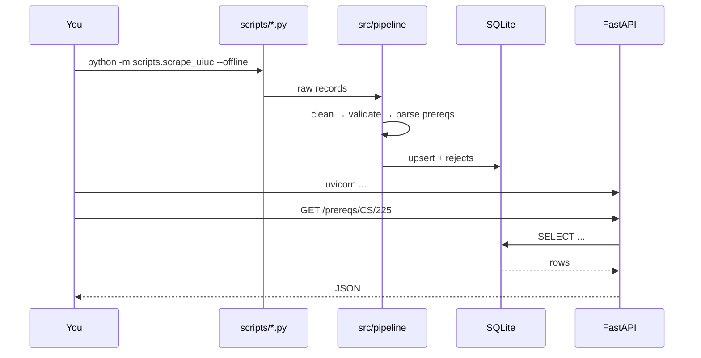

# Workflow

How to actually work in this repo, day to day. Written as if you're
the intern picking it up.

## Local dev loop



## Adding a new dataset (the checklist)

1. **One-paragraph proposal.** Add an entry to
   [data-catalog.md](data-catalog.md) *before* writing code. Force
   yourself to answer: what is this, where's it from, refresh cadence,
   owner, PII flags, known issues.
2. **Scraper.** Add `src/scrapers/<name>.py`. Keep it dumb: fetch +
   parse, no DB, no cleaning. Reuse `scrapers.base.get()` for retries.
3. **Schema.** Add tables to [../src/db/schema.sql](../src/db/schema.sql).
   Prefer relational tables over JSON blobs unless the data really is
   document-shaped.
4. **Loader.** Add `upsert_<thing>()` in
   [../src/db/database.py](../src/db/database.py). Always support re-runs
   (idempotent upsert, not append-only inserts).
5. **Cleaning.** Add pure functions in
   [../src/pipeline/clean.py](../src/pipeline/clean.py). No I/O.
6. **Validation.** Add checks in
   [../src/pipeline/validate.py](../src/pipeline/validate.py). Reject to
   the `rejects` table, don't drop silently.
7. **Script.** Add `scripts/scrape_<thing>.py`. Same argparse pattern
   as the existing two — makes it easy to script + cron later.
8. **Endpoint.** Add a read endpoint in
   [../src/api/main.py](../src/api/main.py).
9. **Tests.** Minimum: one parser test, one validation test, one API
   test.
10. **Example.** Append a runnable snippet to
    [examples.md](examples.md).

## Running tests

```powershell
pytest -q            # all tests
pytest -q -k prereq  # just the prereq parser tests
pytest --cov=src     # coverage (install pytest-cov first)
```

The tests all use an ephemeral SQLite file so they can't corrupt your
real `datahub.db`.

## Debugging a bad row

If a scrape lands unexpected data:

```sql
SELECT reason, COUNT(*) FROM rejects GROUP BY reason ORDER BY 2 DESC;
SELECT * FROM rejects WHERE reason LIKE '%bad subject%' LIMIT 5;
```

Then either loosen a validation rule (and add a test that pins the new
behavior) or fix the parser.

## When to reach for an LLM

The rule-based agent handles the templates we've built. If a
researcher's question doesn't fit, three options in order of preference:

1. Add a new template. Cheap, deterministic, tested.
2. Preprocess the question ("courses that need CS 225" → matches the
   existing "which courses require" template).
3. Wire in an LLM tool-call backend behind the same interface — see
   the comment at the bottom of
   [../src/agent/nl_to_sql.py](../src/agent/nl_to_sql.py). The
   rule-based path becomes your evaluation baseline.
